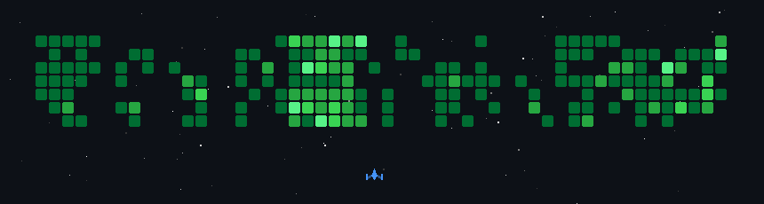

<div align="center">

<!-- Auto-generated from contribution history -->


```
$ whoami
→ haaris — co-founder · security engineer · researcher

$ cat /etc/mission
→ scaling mental health for 400M Indian Gen Z
→ red-teaming APIs before the hackers do
```

<br/>


&nbsp;


</div>

---

## What I'm Building

**[Bondhu AI](https://github.com/mdhaarishussain)** — Replacing the therapist shortage for 400M Indian Gen Z with a proactive digital twin companion. Multi-agent system that senses behavioral shifts from entertainment and social footprints, then acts before you even ask. *Pre-incubated by Startup ki Paathshala.*

**[Chaos Kitten](https://github.com/mdhaarishussain/chaos-kitten)** — Red-teaming APIs before the hackers do. 20+ attack vectors across OWASP A01 & CWE-200, SARIF reporting, built for the CNCF ecosystem.

**[Sentinel](https://github.com/SKfaizian-786/sentinel-devops-agent)** — Autonomous DevOps agent that predicts infrastructure failures and auto-heals services for 24/7 uptime.

**[Heartisans](https://github.com/Heartisans/Heartisans1)** `SAP Top 10` — AI sustainability scoring that bridges artisans with digital markets.

---

## Research

| Paper | Venue | Status |
|-------|-------|--------|
| **Forensic Detection of Deepfakes Using CNNs** | D4N6 Journal (CyberPeace × MeitY) | `Published` |
| **Influenza Outbreak Prediction — MSDII-FFNN, 90% precision** | NSCADF 25 | `Defended` |
| **Explainability in Multimodal Digital-Twin Architectures** | — | `Manuscript` |
| **Bondhu-Base: Open-Source Emotional Foundation Model** | ANRF AI-SE Mission | `Pre-proposal` |

---

## Tech Stack

<div align="center">


<!--

---

<div align="center">

<picture>
  <source media="(prefers-color-scheme: dark)" srcset="https://raw.githubusercontent.com/mdhaarishussain/mdhaarishussain/output/github-snake-dark.svg" />
  <source media="(prefers-color-scheme: light)" srcset="https://raw.githubusercontent.com/mdhaarishussain/mdhaarishussain/output/github-snake.svg" />
  
</picture>

</div>

-->

<div align="center">

*I build AI systems that sense, reason, and act — then I make them explain themselves.*

<a href="https://linkedin.com/in/mdhaarishussain"></a>
<a href="https://www.researchgate.net/profile/Md-Haaris-Hussain"></a>
<a href="mailto:mdhaarishussain@gmail.com"></a>

</div>
