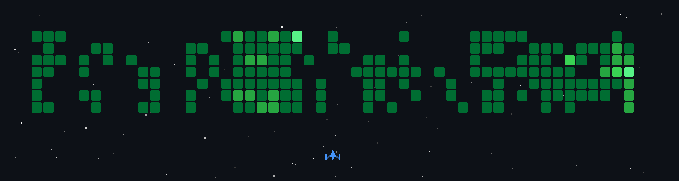

<div align="center">

<!-- Auto-generated from contribution history -->


```
$ whoami
→ haaris — lead AI engineer @ Flora Carbon AI · founder, Bondhu AI

$ cat /etc/focus
→ agentic systems that ship to production, not demos
→ RAG · multi-agent orchestration · AI security
```

<br/>


</div>

---

## Now

**Lead AI Engineer at [Flora Carbon AI](https://floracarbon.ai)** — building the AI and platform layer for forestry carbon markets and climate finance. Most of my commits land here, in private repos.

---

## What I've Built

**Bondhu AI** — Founder. A proactive digital-twin companion for India's therapist gap: a multi-agent system that notices behavioral shifts from entertainment and social signals and checks in before you have to ask. *Pre-incubated by Startup ki Paathshala.*

**[Chaos Kitten](https://github.com/mdhaarishussain/chaos-kitten)** — Agentic API red-teaming. 20+ attack vectors across OWASP A01 & CWE-200, SARIF reporting, built for the CNCF ecosystem.

**[Sentinel](https://github.com/SKfaizan-786/sentinel-devops-agent)** — Autonomous DevOps agent that predicts infrastructure failures and auto-heals services.

**[Heartisans](https://github.com/Heartisans/Heartisans1)** `SAP Top 10` — AI sustainability scoring that connects artisans with digital markets.

---

## Research

| Paper | Venue | Status |
|-------|-------|--------|
| **Forensic Detection of Deepfakes Using CNNs** | D4N6 Journal (CyberPeace × MeitY) | `Published` |
| **Influenza Outbreak Prediction — MSDII-FFNN, 90% precision** | NSCADF 25 | `Defended` |
| **Explainability in Multimodal Digital-Twin Architectures** | — | `Manuscript` |
| **Bondhu-Base: Open-Source Emotional Foundation Model** | ANRF AI-SE Mission | `Pre-proposal` |

---

## Tech Stack

<div align="center">


</div>

---

<div align="center">

*I build AI systems that sense, reason, and act — then I make them explain themselves.*

<a href="https://linkedin.com/in/mdhaarishussain"></a>
<a href="https://www.researchgate.net/profile/Md-Haaris-Hussain"></a>
<a href="mailto:mdhaarishussain@gmail.com"></a>

</div>
